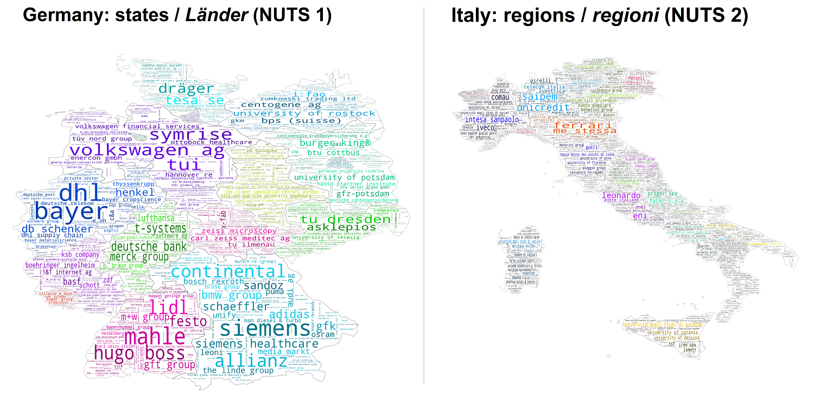

================
wordcloud_mapper
================

.. image:: https://img.shields.io/pypi/v/wordcloud_mapper.svg
        :target: https://pypi.python.org/pypi/wordcloud_mapper

.. image:: https://img.shields.io/travis/GabZech/wordcloud_mapper.svg
        :target: https://travis-ci.com/GabZech/wordcloud_mapper

.. image:: https://readthedocs.org/projects/wordcloud-mapper/badge/?version=latest
        :target: https://wordcloud-mapper.readthedocs.io/en/latest/?version=latest
        :alt: Documentation Status

`wordcloud_mapper` is a Python package that allows one to **create wordclouds shaped like regions in a map**. Such visualisations are especially useful when communicating sets of data that consist of many different observations and each observation is attributed to a specific region and size of occurrence. Take the example below, a dataset containing the name of the 100 biggest companies (in terms of estimated number of employees) for each region in Germany and Italy in 2019.

Installation
------------

To install `wordcloud_mapper`, run this command in your terminal:

.. code-block:: console

    pip install wordcloud_mapper

**This is the preferred method to install wordcloud_mapper**, as it will always install the most recent stable release.

The sources for `wordcloud_mapper` can be downloaded by cloning the public Github repository https://github.com/GabZech/wordcloud_mapper.

Features and usage
------------------

* To **learn how to use the package** and its main features, visit https://gabzech.github.io/wordcloud_mappeR.
* To **see the documentation** and understand the specific arguments passed to each function, visit: https://wordcloud-mapper.readthedocs.io.

Notes on geographical nomenclature
----------------------------------

The classification of regions used here follows the European Union's Nomenclature of Territorial Units for Statistics (`NUTS <https://en.wikipedia.org/wiki/Nomenclature_of_Territorial_Units_for_Statistics>`_), a geocode standard for referencing the subdivisions of countries. The advantage of using this system is that the classification of regions across countries is **standardised and hierarchically structured**. For instance, Germany has the base code *DE* (NUTS 0), the state of Bavaria has the code *DE2* (NUTS 1), its subregion of Oberbayern has the code *DE21* (NUTS 2) and the city of Munich has the code *DE212* (NUTS 3). Since each region is given a unique identifier which is directly linked to the regional level above it, it is fairly easy to identify and match any dataset to these regions.

However, this means that **this package currently only works for creating wordcloud maps for EU countries**. For an overview of the NUTS regions and levels, you can browse the available `maps for each EU country <https://ec.europa.eu/eurostat/web/nuts/nuts-maps>`_ or use `this interactive map <https://ec.europa.eu/statistical-atlas/viewer/?config=typologies.json&>`_ instead. If you have a dataset containing postcodes and want to convert these to NUTS regions, you can find the `correspondence tables here <https://ec.europa.eu/eurostat/web/nuts/correspondence-tables/postcodes-and-nuts>`_.

In a future release, support nor non-NUTS regional referencing systems will be implemented.

Acknowledgements
----------------

* Special thanks to Leonard Mandtler for providing a first prototype of a wordcloud mapping function and to Julian Kath and Lorenzo Gini for co-developing a functioning version of `wordcloud_mapper in R <https://gabzech.github.io/wordcloud.mappeR>`_, which served as the basis for developing the first version of this package.
* This package was created with Cookiecutter_ and the `audreyr/cookiecutter-pypackage`_ project template.

.. _Cookiecutter: https://github.com/audreyr/cookiecutter
.. _`audreyr/cookiecutter-pypackage`: https://github.com/audreyr/cookiecutter-pypackage
